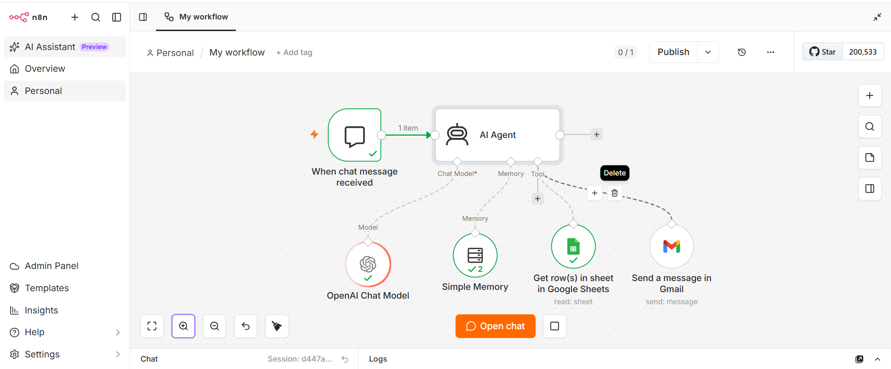

# Autonomous AI Data Analyst Agent (n8n & OpenAI)

An autonomous AI Agent workflow built with **n8n**, **OpenAI**, **Google Sheets**, and **Gmail**. The agent acts as a conversational data analyst—capable of inspecting spreadsheet datasets, running analytical evaluations, and sending structured HTML email summaries to stakeholders.


./assets/n8n output.png

---

## Key Features

- **Autonomous Tool Selection:** Uses OpenAI Function Calling to dynamically decide when to fetch data from Google Sheets or deliver reports via Gmail.
- **Contextual Conversational Memory:** Retains multi-turn conversation state using n8n’s `Simple Memory` node.
- **Automated HTML Reporting:** Generates clean, well-formatted HTML email reports directly delivered via Gmail.
- **Structured System Prompting:** Enforces strict role boundary, tool guidelines, and email output formatting using XML-tagged prompt templates.

---

## Tech Stack & Tools

- **Workflow Automation:** n8n (Self-hosted / Cloud)
- **LLM Engine:** OpenAI Chat Model (`gpt-4o` / `gpt-3.5-turbo`)
- **Integrations:** Google Sheets API, Gmail API
- **Memory Management:** n8n Simple Memory Node (Buffer Window Memory)

---

## 🚀 How to Import & Setup

1. **Clone the repo:**
   ```bash
   git clone [https://github.com/your-username/n8n-ai-data-analyst.git](https://github.com/your-username/n8n-ai-data-analyst.git)
   ```
2. **Import Workflow:**
   - Open your n8n instance.
   - Click **Workflows** > **Import from File**.
   - Select `workflow/ai_data_analyst_agent.json`.
3. **Configure Credentials:**
   - Connect your **OpenAI API Key**.
   - Authenticate your **Google Sheets** and **Gmail** accounts.
4. **Run:** Open the chat interface and start querying your spreadsheet data!
